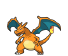
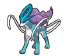
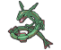
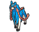

<div align="center">








# PKHeX for Mac

**A native macOS front-end for [PKHeX](https://github.com/kwsch/PKHeX).**

[](LICENSE)
[-lightgrey.svg)](#building)
[](https://dotnet.microsoft.com/download/dotnet/10.0)
[](https://github.com/kwsch/PKHeX)

</div>

---

## What this is

PKHeX is a Windows Forms application. This project keeps **PKHeX.Core untouched** — the save
parsing, legality engine, encounter tables, all of it — and puts an [Avalonia](https://avaloniaui.net)
interface on top of it that is built for macOS.

Upstream is a **git submodule pinned to a commit**, not a fork and not a vendored copy. None of
Kurt's code is duplicated here. Everything in this repository is the UI layer.

```text
PKHeX.Mac/          the interface — views, view models, services
PKHeX.Mac.Tests/    177 tests covering the parts that aren't PKHeX.Core's job
upstream/PKHeX/     submodule → github.com/kwsch/PKHeX
scripts/            update upstream, sync sprites, package the .app
```

## What this isn't

Not a replacement for PKHeX, and not a competitor to it. If you're on Windows, use
[the real thing](https://github.com/kwsch/PKHeX) — it is more capable, more complete, and
better tested. This exists because the Windows Forms UI doesn't run natively on a Mac.

Feature coverage is a subset of upstream's. The engine is identical, so anything PKHeX.Core
can read, this can read; the gap is only in what the interface exposes.

## The basics

Boxes and party with drag-to-move, the trainer and bag editors, Pokédex, Tera Raids, Mystery
Gift album, Hall of Fame, daycare, fusions, event flags, and a raw save-block browser for
anything the interface doesn't surface yet. Legality comes straight from PKHeX.Core.

## Beyond a port

The parts that aren't just Windows Forms redrawn.

### Several saves at once

Saves open in tabs, browser-style. A Pokémon can be sent from one open save to another, with
the format conversion that implies handled on the way across.

### Nothing gets written by surprise

Every edit is tracked as you make it. Before exporting you can **review the exact diff** about
to be written, and revert at three scopes — the whole save, a single slot, or inspector edits
you haven't applied yet. There's a running change log, and exporting backs up the file it's
about to overwrite.

### Analysis PKHeX.Core doesn't do

PKHeX.Core validates legality, one Pokémon at a time. These look wider:

- **Integrity audit** — compares entries *against each other* for shared identifiers, suspicious
  IV concentration, and met-location clusters. Legality checking is blind to this by design,
  because it never sees two Pokémon together. Findings are reported with how unlikely they are
  and what innocently explains them; fixed-seed event distributions really do hand everyone the
  same PID.
- **Box report** — what a box holds, and what in it fails a check
- **Team analysis and type coverage** — including a type chart, which PKHeX.Core has no reason
  to carry
- **Breeding planner and egg-move lookup** — what can pass a move, and what to fix first

### Reaching what the games hide

- The **ride legendary** — Koraidon or Miraidon — lives in a box you can't open. It's presented
  here as a real, editable slot.
- **Pokémon parked by an active fusion**, recoverable without breaking the fusion
- **The Crown Tundra**, below

### Quality of life

- **Command palette** — type to go anywhere, including straight to a specific editor tab
- Remembers your window, your box, and which saves you had open
- Full keyboard control of the grids
- Type-ahead move fields instead of scrolling a 693-entry dropdown
- The interface hides what a save doesn't have, rather than showing something that then
  explains itself away
- Checks GitHub for newer PKHeX releases and tells you when the engine is behind

### Rescuing a stuck Dynamax Adventure

Sword/Shield picks each Dynamax Adventure's rentals and encounters from a seed, and only
advances that seed when a run **finishes**. If a run can never finish, every retry replays the
identical encounters and the save is stuck permanently — with no in-game way out.

That is not hypothetical. It cost this project's author five months on the mandatory first
Max Lair run before the cause was found.

The Crown Tundra tab rolls a new seed, clears the Dynite Ore entry fee, and exposes the 48
once-per-save legendary capture flags and the Galarian Star Tournament partner flags. Most of
those blocks are unnamed in PKHeX; their keys were recovered by brute-forcing the FNV-1a-64
hash the game uses, and the derivations are pinned in tests against the keys PKHeX does
document, so a typo fails the build instead of writing to the wrong block in someone's save.

## Building

Requires [.NET 10](https://dotnet.microsoft.com/download/dotnet/10.0) and an Apple Silicon Mac.

```sh
git clone --recurse-submodules https://github.com/jack-huffman/pkhex-mac.git
cd pkhex-mac
dotnet build PKHeX.Mac -c Debug
dotnet run  --project PKHeX.Mac
```

Build a distributable, self-contained bundle:

```sh
./scripts/package-app.sh            # → dist/PKHeX.app
./scripts/package-app.sh --install  # → also replaces /Applications/PKHeX.app
```

The bundle is ad-hoc signed rather than notarized, so macOS will quarantine it on a machine
that didn't build it. Clear that with `xattr -dr com.apple.quarantine /Applications/PKHeX.app`.

## Tracking upstream

```sh
./scripts/update-upstream.sh
```

Fetches the latest PKHeX master, prints the commit range and a link to the release notes,
re-syncs sprites, rebuilds, and runs the tests — rolling back with a printed command if either
step fails.

Compiled bindings are enabled, so a XAML binding pointing at something upstream renamed is a
build error (`AVLN2000`), not a silent runtime failure. What that can't catch is semantics
changing under an unchanged signature, which is why the script makes you look at the changelog.

## Credits

**[PKHeX](https://github.com/kwsch/PKHeX) by Kurt (@kwsch)** and its contributors. The entire
save-editing engine is theirs; this project only draws the windows.

Sprites come from upstream's collections — [pokesprite](https://github.com/msikma/pokesprite)
(MIT) and the [National Pokédex – Icon Dex](https://www.deviantart.com/pikafan2000/art/National-Pokedex-Version-Delta-Icon-Dex-824897934)
project. Optional high-resolution artwork is fetched at build time from
[PokeAPI/sprites](https://github.com/PokeAPI/sprites) and is not redistributed here.

## License

[GPL-3.0](LICENSE), inherited from PKHeX. UI © Jack Huffman; engine © Kurt (Kaphotics).

> We do not support or condone cheating at the expense of others. Do not use significantly
> hacked Pokémon in battle or in trades with those who are unaware hacked Pokémon are in use.
